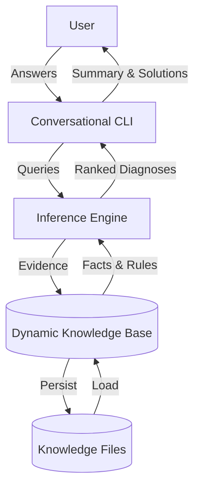

# Advanced Computer Problem Diagnosis Expert System

[](https://www.swi-prolog.org/)
[](https://opensource.org/licenses/MIT)
[](https://github.com/LeulTew/advanced-computer-diagnosis/actions)

An expert companion that diagnoses computer problems like a seasoned support engineer. The system blends rule-based reasoning, confidence scoring, and guided questioning to surface likely root causes, propose remedies, and grow smarter with every session.

## ✨ Highlights at a Glance

- 🧠 **Expert Knowledge Base** – Curated symptoms, causes, and solutions spanning hardware, software, and network incidents.
- 🎛️ **Adaptive Dialogue** – Conversational CLI that handles *yes / no / unsure* answers and probes deeper when signals conflict.
- 📈 **Confidence Analytics** – Bayesian-inspired weighting elevates the most plausible hypotheses while demoting unlikely ones.
- 🧩 **Live Learning Loop** – Teach the expert new symptoms, causes, and repair steps on the fly, then persist them for the future.
- 🔍 **Transparency First** – Inspect what the system knows, why it reached a decision, and how evidence shifted confidence.
- 🧱 **Composable Architecture** – Clear separation of inference, knowledge, persistence, and experience layers makes extension painless.
- 🗣️ **Natural Language & Voice** – Seed diagnoses with free text or optional speech-to-text (Vosk) before guided questioning.
- 🌐 **Multi-language Prompts** – Switch between English and Spanish instantly; extendable to more locales.
- 📊 **Built-in Analytics** – Session summaries, JSONL logging, and quick stats on total runs and top causes.

## 🧭 Table of Contents

1. [Vision & Story](#-vision--story)
2. [System Architecture](#-system-architecture)
3. [Knowledge Lifecycle](#-knowledge-lifecycle)
4. [Quickstart](#-quickstart)
5. [CLI Tour](#-cli-tour)
6. [Analytics & Reporting](#-analytics--reporting)
7. [Tooling & Automation](#-tooling--automation)
8. [Documentation](#-documentation)
9. [Testing & Quality](#-testing--quality)
10. [Contribution Guide](#-contribution-guide)
11. [Roadmap & Inspirations](#-roadmap--inspirations)
12. [License](#-license)

## 🚀 Vision & Story

> "A frontline IT agent that never sleeps, forgets, or loses patience."

Modern support desks juggle repetitive troubleshooting while trying to capture rare expertise. This project reimagines that experience in SWI-Prolog: a knowledge-driven expert that interviews the user, reasons about probable faults, and prescribes actionable fixes—all while learning from every encounter.

Goals:

- Reduce time-to-diagnosis for recurring PC issues.
- Provide newcomers a trustworthy co-pilot when senior engineers aren’t available.
- Preserve tribal knowledge in a transparent, auditable format.

## 🏗️ System Architecture

<div align="center">



</div>

### Layer Breakdown

- **Experience Layer (`main/0`)** – Menu-driven CLI that orchestrates sessions, validates input, and narrates results.
- **Reasoning Layer (`find_causes/2`, `adjust_confidence/2`)** – Computes weighted scores per cause and ranks hypotheses.
- **Knowledge Layer (`symptom/1`, `cause/1`, `solution/2`, `symptom_cause/2`, `confidence/2`)** – Houses curated facts and learned additions.
- **Persistence Layer (`save_kb/1`, `consult/1`)** – Serializes knowledge so new learnings survive restarts.

### Data Contracts

- Symptoms: atoms describing observed behavior (e.g., `slow_performance`).
- Causes: atoms representing root causes (e.g., `hardware_failure`).
- Solutions: human-readable strings mapped to causes.
- Confidence: floats `0.0…1.0` reflecting baseline trust before adjusting for evidence.

### Edge Case Playbook

- **Conflicting Answers** – Negative evidence demotes confidence by 0.5 to prevent false positives.
- **Unknown Territory** – If no causes match, the system returns `unknown` to prompt knowledge expansion.
- **Sparse Data** – Normalizes scores by the number of associated symptoms, protecting causes with few links from over-inflation.

## 🔄 Knowledge Lifecycle

| Phase | What Happens | Prolog Entry Points |
| --- | --- | --- |
| Capture | User teaches new symptom/cause/solution | `learn_symptom/0`, `learn_cause/0`, `learn_solution/0` |
| Reason | Answers translate into weighted evidence | `calculate_score/3` |
| Explain | System shares ranked causes & rationale | `present_diagnosis/1`, `explain_diagnosis/1` |
| Persist | Knowledge stored for future sessions | `save_kb/1`, `load_knowledge/0` |

Tip: check the current knowledge snapshot anytime via the **View knowledge base** menu. It prints symptoms, causes, confidences, and solutions with curated formatting.

## ⚡ Quickstart

### 0. One-liner setup (optional)

Prefer automation? Let the project script install dependencies, set up the optional Python voice environment, and run health checks:

```fish
bash scripts/install.sh
```

Skip the script if you want to manage packages manually.

### 1. Install SWI-Prolog

```fish
sudo apt update
sudo apt install swi-prolog
```

### 2. Clone & Verify

```fish
git clone https://github.com/LeulTew/advanced-computer-diagnosis.git
cd advanced-computer-diagnosis
swipl -s diag.pl -g halt
```

### 3. Fire Up the Expert

```fish
swipl -s diag.pl -g main
```

If you see the menu, you’re ready to diagnose.
Just enter the menu number (e.g., `1`)—no trailing period required.

### Optional: Enable Voice Input

Install the Python dependencies and download a Vosk acoustic model (e.g., `vosk-model-small-en-us-0.15`). Point the `VOSK_MODEL_PATH` environment variable to the unpacked model directory.

```fish
python3 -m pip install -r requirements.txt
set -x VOSK_MODEL_PATH /absolute/path/to/vosk-model-small-en-us-0.15
```

The **Voice input** menu option falls back to guided mode automatically if prerequisites are missing.

## 🖥️ CLI Tour

### Guided Diagnosis

```
Choose an option:
1. Start diagnosis
> 1
Welcome to the Advanced Computer Problem Diagnosis Expert System!
Does the computer exhibit slow_performance (yes./no./unsure.) yes
Does the computer exhibit frequent_crashes (yes./no./unsure.) unsure
...
Based on the symptoms, the problem(s) might be:
virus (Confidence: 1.35): Solution: Run a full system scan with updated antivirus software.
hardware_failure (Confidence: 0.84): Solution: Check hardware connections and consider replacing faulty components.
```

### Teach the System Something New

```
Choose an option:
2. Learn new symptom
> 2
Enter a new symptom: blue_screen_of_death.
New symptom added to the knowledge base.
```

### Persist Evolving Knowledge

1. Choose option **6** to save: provide a filename like `kb_saved.pl` to create a Prolog snapshot.
2. Choose option **7** later to reload the snapshot and continue diagnosing with the enriched facts.

### Inspect What's Known

Use option **5** and pick the section you want: symptoms, causes, relationships, confidences, or solutions. Perfect for quick audits and workshops.

### Natural Language Seeding

Choose option **2** to describe issues in free text before the guided prompts. Detected phrases ("blue screen", "no sound", "wifi drop", etc.) populate the initial symptom list automatically.

### Voice Mode (Hands-Free)

Option **3** captures a short voice snippet (via Vosk + sounddevice) and transcribes it into seed symptoms. If the environment is not configured, the system gracefully continues in guided mode.

### Switch Languages on the Fly

Use option **11** to toggle between English (`en`) and Spanish (`es`). Prompts and summaries update instantly; answers remain the Prolog atoms `yes.`, `no.`, and `unsure.`

## 📊 Analytics & Reporting

- **Session JSONL log**: Every run appends a record to `data/analytics.jsonl` capturing timestamps, observed symptoms, and ranked diagnoses.
- **Quick stats**: Choose menu option **10** to see total sessions and the most frequent causes. The text is localized automatically.
- **Raw exports**: The analytics file is newline-delimited JSON, ideal for piping into dashboards or further analysis.

Need automated summaries in CI? You can stream the JSONL file through `jq`, convert it to CSV, or feed it into your own reporting pipeline.

## 🛠️ Tooling & Automation

| Task | Command | Notes |
| --- | --- | --- |
| Guided installer | `bash scripts/install.sh` | Detects your platform, installs SWI-Prolog, optionally sets up the Python voice pipeline, and runs checks. |
| Static analysis | `swipl -q -s tools/static_analysis.pl` | Uses `prolog_xref` to flag undefined predicates without loading the CLI. |
| Full check suite | `./scripts/run_checks.sh` | Runs static analysis plus unit/integration tests; ideal for pre-commit hooks and CI. |
| Performance profiling | `./scripts/run_profile.sh` | Benchmarks representative diagnosis scenarios and saves metrics to `data/perf_profile.json`. |

The profiling report includes averages, medians, 95th percentile latency, inference counts, and memory deltas for each scenario—helpful when tuning rules or tracking regressions.

## 📚 Documentation

- `docs/user-guide.md` – Guided walkthrough of the CLI, natural language mode, and troubleshooting tips.
- `docs/developer-guide.md` – Architecture deep dive, coding conventions, and extension recipes.
- `CHANGELOG.md` – Semantic version history covering new capabilities and bug fixes.
- _Video tutorials_ – Planned screencasts will demonstrate voice input setup, knowledge authoring, and analytics review (see roadmap for tracking).

## 🧪 Testing & Quality

Prefer the aggregated script for day-to-day verification:

```fish
./scripts/run_checks.sh
```

This runs static analysis followed by unit and integration suites. If you want to target just one file, fall back to raw `plunit`:

```fish
swipl -s diag.pl -s test/diag_tests.pl -g run_tests -g halt
```

Benchmark the inference engine whenever you tweak reasoning rules:

```fish
./scripts/run_profile.sh --iterations=50
```

Results are stored in `data/perf_profile.json`, making it easy to diff performance across branches.

Add new predicates? Mirror them with unit tests (`plunit`) for consistent reliability. Consider enabling the optional GitHub Actions workflow for automatic validation on pull requests.

## 🤝 Contribution Guide

1. Fork this repo and create a topic branch: `git checkout -b feature/my-upgrade`.
2. Keep commits focused and descriptive.
3. Run tests before submitting a pull request.
4. Document new predicates and update the knowledge base narrative as needed.
5. Open a PR that explains *what changed*, *why it matters*, and *how to test*.

Ways to contribute beyond code:

- Interview support teams to expand the knowledge base.
- Draft user walkthroughs or tutorials.
- Prototype integrations (web UI, analytics exporters, etc.).

## 🗺️ Roadmap & Inspirations

Active improvement themes span knowledge persistence, probabilistic reasoning, user experience polish, tooling, docs, and distribution. Browse `tasks.md` for a living roadmap—and feel free to tackle an item or pitch a new idea!

Inspirations: classic MYCIN-style expert systems, modern support triage playbooks, and human-centered IT service design.

## 📜 License

Released under the [MIT License](LICENSE). Use it, extend it, and share the expertise!

---

Crafted with curiosity and SWI-Prolog. If it helped you solve an issue, let us know and we’ll celebrate in the changelog! 🎉
